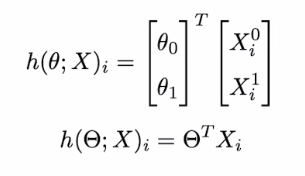

## Aprendizado de Máquina - Regressão
- Como fazer regressão linear univariada;

### Regressão - Introdução
- O que é?
     - Tenta prever valores numéricos diretamente a partir de atributos de um novo exemplo;
- Exemplos:
    - Prever a temperatura de amanhã a partir das condições atmosféricas;
    - Estimar o preço de uma casa a aprtir de seu tamanho;
- Definição do problema:
    - Aproximar uma variável quantitativa Y e R (resposta);
    - A partir de variáveis preditoras X1, ..., Xn e R;
        - Quando n = 1: regressão simples ou univariada;
        - Quando n > 1: regressão multivariada;
    - Objetivo: Encontrar a função h (hipótese):

            Y ≈ h(X1, ..., Xn) 

- Estratégia:
    - Utilizar um conjunto de exemplos (dataset) onde a resposta correta é conhecida para 'aprender' um modelo.

- Idealmente, o algoritmo para aprender o modelo deve:
    - Ser capaz de reconstruir o fenômeno modelado com maior precisão possível (a não ser por um erro quantificável);
    - Requerer o mínimo possível de dados para o aprendizado;
    - Representar o modelo da maneira mais simples possível (Navalha de Occam);
    - Não há uma 'resposta correta' para todos os problemas;
    - Existem muitos tipos de modelos (modelos lineares, árvores, redes neurais, etc.)

### Regressão Linear Univariada
- Equação de uma reta: y = mx + n

        m = coeficiente angular (indica inclinação da reta)
        n = coeficiente linear (intercept)
- Hipótese: 
    - Variável y de resposta tem uma relação linear com os atributos

            Y = θ0 + θ1X
    - h é representado como uma reta:
    
            h(θ; X) = θ0 + θ1X
- Utilizando notação de matrizes:
    - Considerando X⁰ = 1 para generalização:
    

    - Objetivo: achar melhor reta (θ) de acordo com os dados de treinamento
- E o que seria a melhor reta?
    - Encontrar a reta h que passe o mais próximo possível de todos os pontos
- Resíduo:
    - Diferença entre o valor Y real e a estimativa Ŷ = h(θ; X):

            Ei = Yi - Ŷi
- Uma maneira de calcular θ0 e θ1 é se basear na soma do quadrado dos resíduos (RSS - Residual Sum of Squares)
#### Cálculo do Gradiente:
- O gradiente de um vetor é uma generalização da derivada e é representado pelo operador vetorial. Esta operação é usada para minimizar a nossa função de custo (RSS)

- Solução analítica (verificar slides e aula):
    - Seria o mesmo que:

            Cov(X¹, Y)
            ----------
              Var(X¹)
    - Método dos mínimos quadrados (Least Squares)
    - Problema:
        
            θ = (XTX)^-1 XTY
    - Desvantagens de usar a solução analítica:
        - XTX nem sempre é invertível;
        - A complexidade do cálculo da inversa é da ordem O(n³):
            - Se o número de recursos for alto, pode se tornar- computacionalmente custoso;
            - Altíssimo consumo de memória.

#### Técnica da Descida do Gradiente
- Learning rate
    - Muito pequeno: passos pequenos em direção ao ponto de mínima na curva;
    - Muito grande: pode ser que nunca atinja o ponto de mĩnima na curva;

#### Avaliação da Regressão - Como saber se o resultado foi bom?
- O próprio RSS pode ser utilizado;
- Estatística R²
    - Mede a proporção da variabilidade de Y que pode ser explicada por X;

