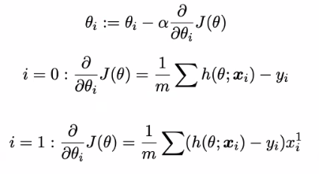

## Regressão Linear
### Regressão Multivariada
- Multiplas variáveis preditivas que serão utilizadas para tentar aproximar a variável alvo;
- Na maior parte dos problemas práticos, utilizar apenas um atributo não é o suficiente para estimar a resposta;
- Neste caso, a Regressão linear deve estimar um Hiperplano como modelo h;
- O Y ainda será uma combinação linear, mas agora iremos adicionar n preditores (n variáveis para acertar a reta para ficar o mais próximo possível do dataset);
- Assim como no caso univariado, valores de θ devem ser excolhidos baseados no conjunto de treinamento;
- O método dos mínimos quadrados também funciona para o caso multivariado;
- Outra possibilidade de realizar o aprendizado é através do método de Descida do Gradiente (Gradient Descent);

### Descida do Gradiente
- Partindo da função de custo de Erro Quadrático Médio;
- Definir parâmetros θ que minimizem J;

#### Algoritmo Gradiente Descendente
- Iniciar θ aleatoriamente;
- Modificar valores de θ (seguindo o gradiente), para reduzir J até que um valor mínimo seja atingido;

#### Como computar a atualização (do parametro θ)?
- Repetir até a convergência, para cada parâmetro θ;
- α é a taxas de aprendizado, que controla o "salto" na atualização dos parâmetros;

### Análise dos Resíduos
- O componente determinístico de um modelo de regressão faz um trabalho tão bom ao explicar a variável dependente que deixa apenas a parte intrinsecamente inexplicável de sua área de estudo para o erro;
    - Existência de não aleatoriedade no erro: variáveis independentes não estão explicando tudo o que podem;
- Gráficos de resíduos exibem os valores residuais no eixo y e os valores preditos no eixo x;
- Se exibem padrões indesejados, não podemos confiar nos coeficientes de regressão. Os resíduos são consistentes com o erro aleatório;
- Verifique se os resíduos estão espalhados aleatoriamente em torno de zero para toda a gama de valores ajustados;
- Quando temos um padrão, infelizmente, algumas das informações explicativas vazaram para o erro supostamente aleatório;

### F-Test
- O valor p para cada variável independente testa a hipótese nula de que a variável não tem correlação com a variável dependente;
- Comparar com nível de significância (1 - intervalo de confiança);
    - Valores menores que o nível de significância;

### Multicolinearidade
- Situação em que duas ou mais variáveis preditoras estão intimamente relacionadas entre si;
- Pode representar problemas no contexto de regressão;
- Difícil separar os efeitos individuais de variáveis colineares na resposta;
    - Pode ser difícil determinar como cada um separadamente está associado à resposta;
- Um coeficiente θi representa a mudança média na variável dependente para cada mudança de 1 unidade em uma variável independente quando mantidas todas as outras variáveis independentes constantes;
    - Você pode alterar o valor de uma variável independente e não das outas;
- Quando as variáveis independentes são correlacionadas, indica que as mudanças em uma variável estão associadas a mudanças em outra variável;
    - Quanto mais forte a correlação, mais difícil é mudar uma variável sem mudar outra;
- Problema! - ver slide
- Esses problemas afetam apenas as variáveis independetes que estão correlacionadas;
    - É possível ter um modelo com multicolinearidade severa e ainda algumas variáveis no modelo podem ser completamente afetadas;
    - Você nem sempre precisa encontrar uma maneira de corrigir a multicolinearidade;
- O fator de inflação de variância (VIF) identifica a correlação entre as variáveis independetes e a força dessa correlação;
    - 1 indica que não há correlação entre esta variável independente e quaisquer outras;
    - Entre 1 e 5 sugerem que há uma correlação moderada, mas não é severa o suficiente para justificar medidas correticas;
    - Valores maiores que 5 representam níveis críticos de multicolinearidade;

### Vantagens e Desvantagens
- Vantagens:
    - Aprendizado eficiente;
    - Modelo simples de se visualizar e compreender;
- Desvantagens:
    - Muitos problemas reais não são lineares;
        - Não vamos conseguir capturar um comportamento utilizando uma equação linear;
